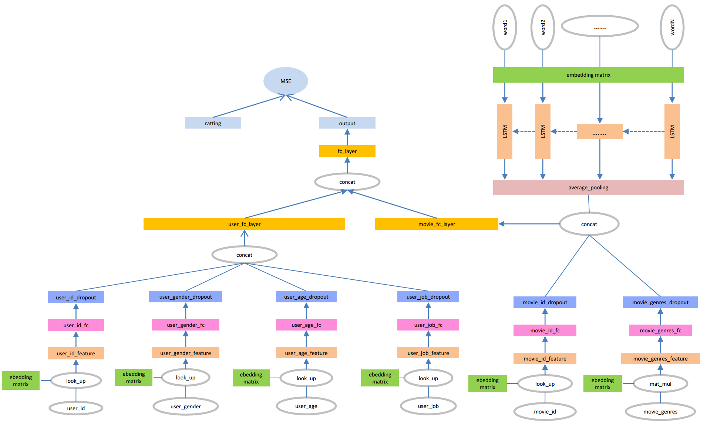

# 在MovieLens 1M数据集上使用深度学习进行评分预测和推荐（上）

## MovieLen 1M数据及简介
MovieLens 1M数据集包含包含6000个用户在近4000部电影上的100万条评分，也包括电影元数据信息和用户属性信息。下载地址为：   
[http://files.grouplens.org/datasets/movielens/ml-1m.zip](http://files.grouplens.org/datasets/movielens/ml-1m.zip)   
数据集分为三个文件：电影元数据信息（movie.data）、用户属性信息（users.data)和用户评分数据（ratings.dat)。

### 电影元数据
电影元数据的格式为：MovieID::Title::Genres。
- Title：电影名IMDB提供的电影名相同（包括发布年份）
- Genres：多种电影题材由是“|”分隔，题材种类有以下18种：
	* Action
	* Adventure
	* Animation
	* Children's
	* Comedy
	* Crime
	* Documentary
	* Drama
	* Fantasy
	* Film-Noir
	* Horror
	* Musical
	* Mystery
	* Romance
	* Sci-Fi
	* Thriller
	* War
	* Western
- MovieID：模型MovieID没有对应的电影（MovieID不是连续递增的）
### 用户属性信息
用户属性信息的格式为：UserID::Gender::Age::Occupation::Zip-code，用户属性信息是用户自愿填写的，真实性没有做过校验。

- Gender：“M”表示男，“F”表示女
- Age:年龄值有以下几种：
	*  1:  “小于18岁”
	* 18:  "18-24"
	* 25:  "25-34"
	* 35:  "35-44"
	* 45:  "45-49"
	* 50:  "50-55"
	* 56:  "56+"
- Occupation：职业有以下几种：
	*  0:  "other" or not specified
	*  1:  "academic/educator"
	*  2:  "artist"
	*  3:  "clerical/admin"
	*  4:  "college/grad student"
	*  5:  "customer service"
	*  6:  "doctor/health care"
	*  7:  "executive/managerial"
	*  8:  "farmer"
	*  9:  "homemaker"
	* 10:  "K-12 student"
	* 11:  "lawyer"
	* 12:  "programmer"
	* 13:  "retired"
	* 14:  "sales/marketing"
	* 15:  "scientist"
	* 16:  "self-employed"
	* 17:  "technician/engineer"
	* 18:  "tradesman/craftsman"
	* 19:  "unemployed"
	* 20:  "writer"
### 电影评分
电影评分的格式为：UserID::MovieID::Rating::Timestamp 
- UserID: [1-6040]
- MovieIDs:[1,3952]
- Ratings:1-5的整数
- Timestamp：时间戳
- 每个用户至少有20个评分

## 数据预处理与网络模型设计
MovieLens数据集中，用户特征中UserID、Gender、Age、Job以及电影特征中MovieID都可以认为是类别型数据，通常使用One-Hot编码。
但是MovieID和UserID值得类型比较多，如果使用One-Hot编码，每个值都会被编码成一个维数很高的稀疏向量，作为神经网络输入是计算量很大。
除此之外，采用One-Hot编码，不同属性值的距离都是相等的， 比如“小于18岁”和“50+”与“45-49”与“50+”的距离平方都是2。
所以在数据预处理阶段，我们不使用One-Hot编码，而仅仅将这些数据编码成数字，用这些数据当作嵌入矩阵的索引。
神经网络的第一层使用嵌入层，嵌入矩阵通过学习得到。

电影题材和电影名比较特殊，他们可以视作多值属性，且长度不行等。对于电影题材，因为类型不多，可以直接使用Multi-Hot编码，
在神经网络中通过编码后的向量与嵌入矩阵相乘实现不同长度的输入。对于电影名的处理稍微复杂一点，首先创建word->int的映射字典，
然后使用数字列表编码，并填充为相同的长度，经过一个LSTM网络，并对网络的所有输出求均值得到电影名特征。

### 数据预处理
- UserID、Occupation、MovieID不变
- Gender字段：需要将‘F’和‘M’转换成0和1
- Age字段：转成7个连续数字0-6
- Genres字段：多值属性，使用Multi-Hot编码，维数为18
- Title字段：创建word->int的映射字典，然后使用数字列表编码，并填充为相同的长度，维数为15

数据预处理的完整代码见项目中的[pre-processing.py](./pre-processing.py)

#### 电影题材的multi-hot编码函数
```python
def genres_multi_hot(genre_int_map):
    """
    电影类型使用multi-hot编码
    :param genre_int_map:genre到数字的映射字典
    :return:
    """

    def helper(genres):
        genre_int_list = [genre_int_map[genre] for genre in genres.split(b'|')]
        multi_hot = np.zeros(len(genre_int_map))
        multi_hot[genre_int_list] = 1
        return multi_hot

    return helper
```

#### 电影数字列表编码函数
```python
def title_encode(word_int_map):
    """
    将电影Title转成长度为15的数字列表，如果长度小于15则用0填充，大于15则截断
    :param word_int_map:word到数字的映射字段
    :return:
    """

    def helper(title):
        title_words = [word_int_map[word] for word in title.split()]
        if len(title_words) > 15:
            return np.array(title[:15])
        else:
            title_vector = np.zeros(15)
            title_vector[:len(title_words)] = title_words
            return title_vector

    return helper
```
#### 数据预处理函数
```python
def load_data(dataset_zip):
    """
    Load Dataset from Zip File
    """
    with zipfile.ZipFile(dataset_zip) as zf:
        # 读取User数据
        with zf.open('ml-1m/users.dat') as users_raw_data:
            users_title = ['UserID', 'Gender', 'Age', 'JobID', 'Zip-code']
            users = pd.read_table(users_raw_data, sep=b'::', header=None, names=users_title, engine='python')
            users = users.filter(regex='UserID|Gender|Age|JobID')

            # 改变User数据中性别和年龄
            gender_map = {b'F': 0, b'M': 1}
            users['GenderIndex'] = users['Gender'].map(gender_map)

            age_map = {val: ii for ii, val in enumerate(set(users['Age']))}
            users['AgeIndex'] = users['Age'].map(age_map)

        # 读取Movie数据集
        with zf.open('ml-1m/movies.dat') as movies_raw_data:
            movies_title = ['MovieID', 'Title', 'Genres']
            movies = pd.read_table(movies_raw_data, sep=b'::', header=None, names=movies_title, engine='python')
            # 将Title中的年份去掉
            pattern = re.compile(b'^(.*)\((\d+)\)$')

            movies['TitleWithoutYear'] = movies['Title'].map(lambda x: pattern.match(x).group(1))
            # 电影题材Multi-Hot编码
            genre_set = set()
            for val in movies['Genres'].str.split(b'|'):
                genre_set.update(val)

            genre_int_map = {val: ii for ii, val in enumerate(genre_set)}

            movies['GenresMultiHot'] = movies['Genres'].map(genres_multi_hot(genre_int_map))

            # 电影Title转数字列表,word的下标从1开始，0作为填充值
            word_set = set()
            for val in movies['TitleWithoutYear'].str.split():
                word_set.update(val)

            word_int_map = {val: ii for ii, val in enumerate(word_set, start=1)}

            movies['TitleIndex'] = movies['TitleWithoutYear'].map(title_encode(word_int_map))

        # 读取评分数据集
        with zf.open('ml-1m/ratings.dat') as ratings_raw_data:
            ratings_title = ['UserID', 'MovieID', 'ratings', 'timestamps']
            ratings = pd.read_table(ratings_raw_data, sep=b'::', header=None, names=ratings_title, engine='python')
            ratings = ratings.filter(regex='UserID|MovieID|ratings')

    # 合并三个表
    data = pd.merge(pd.merge(ratings, users), movies)

    # 将数据分成X和y两张表
    features, targets = data.drop(['ratings'], axis=1), data[['ratings']]

    return features, targets, age_map, gender_map, genre_int_map, word_int_map, users, movies
```
### 模型设计

本文使用的网络模型如上图所示。网络可以分成两大部分，分别是用户特征网络和电影特征网络，这两个子网络最终通过全连接层输出一个200维的向量，作为用户特征和电影特征。
有了用户特征向量和电影特征向量之后，就可以通过各种方式拟合评分，本文中将两个输入通过只有一个神经元的全连接层，将输出作为评分,
将MSE作为损失函数去优化网络。

#### 用户特征网络
UserID和Age、Gender、Job的处理方式相同，首先将输入作为索引从嵌入矩阵中取出对应的特征向量，其中UserID编码为32维向量，其他特征编码为16维向量。
然后分别在其后添加一个全连接层和一个dropout层，全连接层的神经元个数为32。最后将得到的四个32维的向量拼接到一起形成一个128维的向量，作为全连接层的输入，最后输出一个200维的用户特征向量。
#### 用户特征网络核心代码
```python
def user_feature_network(user_id, user_gender, user_age, user_job, dropout_keep_prob):
    with tf.variable_scope('user_id_embed'):
        user_id_embed_matrix = tf.get_variable('id_embed_matrix', [USER_ID_COUNT, EMBED_DIM],
                                               initializer=tf.truncated_normal_initializer(stddev=0.1))
        user_embed_layer = tf.nn.embedding_lookup(user_id_embed_matrix, user_id, name='id_lookup')

    with tf.variable_scope('user_gender_embed'):
        gender_embed_matrix = tf.get_variable('gender_embed_matrix', [GENDER_COUNT, EMBED_DIM // 2],
                                              initializer=tf.truncated_normal_initializer(stddev=0.1))
        gender_embed_layer = tf.nn.embedding_lookup(gender_embed_matrix, user_gender, name='gender_lookup')

    with tf.variable_scope('user_age_embed'):
        age_embed_matrix = tf.get_variable('age_embed_matrix', [AGE_COUNT, EMBED_DIM // 2],
                                           initializer=tf.truncated_normal_initializer(stddev=0.1))
        age_embed_layer = tf.nn.embedding_lookup(age_embed_matrix, user_age, name='age_lookup')

    with tf.variable_scope('user_job_embed'):
        job_embed_matrix = tf.get_variable('job_embed_matrix', [JOB_COUNT, EMBED_DIM // 2],
                                           initializer=tf.truncated_normal_initializer(stddev=0.1))
        job_embed_layer = tf.nn.embedding_lookup(job_embed_matrix, user_job, name='job_lookup')

    user_id_fc_layer = tf.layers.dense(user_embed_layer, EMBED_DIM,
                                       activation=tf.nn.relu,
                                       kernel_regularizer=tf.nn.l2_loss,
                                       kernel_initializer=tf.truncated_normal_initializer(stddev=0.1),
                                       name='user_id_fc')
    user_id_fc_dropout_layer = tf.layers.dropout(user_id_fc_layer, dropout_keep_prob, name='user_id_dropout')

    gender_fc_layer = tf.layers.dense(gender_embed_layer, EMBED_DIM,
                                      activation=tf.nn.relu,
                                      kernel_regularizer=tf.nn.l2_loss,
                                      kernel_initializer=tf.truncated_normal_initializer(stddev=0.1),
                                      name='user_gender_fc')
    gender_fc_dropout_layer = tf.layers.dropout(gender_fc_layer, dropout_keep_prob, name='user_gender_dropout')

    age_fc_layer = tf.layers.dense(age_embed_layer, EMBED_DIM,
                                   activation=tf.nn.relu,
                                   kernel_regularizer=tf.nn.l2_loss,
                                   kernel_initializer=tf.truncated_normal_initializer(stddev=0.1),
                                   name='user_age_fc')
    age_fc_dropout_layer = tf.layers.dropout(age_fc_layer, dropout_keep_prob, name='user_age_dropout')

    job_fc_layer = tf.layers.dense(job_embed_layer, EMBED_DIM,
                                   activation=tf.nn.relu,
                                   kernel_regularizer=tf.nn.l2_loss,
                                   kernel_initializer=tf.truncated_normal_initializer(stddev=0.1),
                                   name='user_job_fc')
    job_fc_dropout_layer = tf.layers.dropout(job_fc_layer, dropout_keep_prob, name='user_job_dropout')

    with tf.name_scope('user_fc'):
        user_combine_feature = tf.concat(
            [user_id_fc_dropout_layer, gender_fc_dropout_layer, age_fc_dropout_layer, job_fc_dropout_layer], 2)
        user_combine_fc_layer = tf.layers.dense(user_combine_feature, 200,
                                                activation=tf.nn.relu,
                                                kernel_regularizer=tf.nn.l2_loss,
                                                kernel_initializer=tf.truncated_normal_initializer(stddev=0.1),
                                                name='user_fc')
        user_combine_layer_flat = tf.reshape(user_combine_fc_layer, [-1, 200])

    return user_combine_layer_flat
```

#### 电影特征网络
MovieID和Genres的处理方式与用户特征方式一样，唯一不同的是Genres第一层使用的是矩阵乘法不是lookup。每个Title中通过嵌入层之后编码为[15，32]维的特征，
然后通过一层隐层为128个神经元的LSTM，然后对这15个LSTM单元的输出求平均值（注意填充值不参与计算），最终得到一个128维特征向量。
将其与MovieID和Genres输出向量拼接到一起作为全连接层输入，最后得到一个200维向量，作为电影特征向量。

需要注意的是，虽然预处理阶段填充之后的标题长度都是15，但在实际计算时使用dynamic_rnn实现对不同长度输入的处理，并使用mask的方式计算均值。
#### 电影特征网络核心代码
```python
def movie_feature_embed_network(movie_id, movie_genres):
    with tf.variable_scope('movie_id_embed'):
        movie_id_embed_matrix = tf.get_variable('id_embed_matrix', [MOVIE_ID_COUNT, EMBED_DIM],
                                                initializer=tf.truncated_normal_initializer(stddev=0.1))
        movie_id_embed_layer = tf.nn.embedding_lookup(movie_id_embed_matrix, movie_id, name='id_lookup')

    with tf.name_scope('genres_embed'):
        movie_genres_embed_matrix = tf.Variable(tf.random_uniform([MOVIE_GENRES_COUNT, EMBED_DIM], -1, 1),
                                                name='genres_embed_matrix')

        movie_genres_embed_layer = tf.matmul(movie_genres, movie_genres_embed_matrix)

    return movie_id_embed_layer, movie_genres_embed_layer


def movie_title_lstm_layer(movie_titles, movie_title_length, dropout_keep_prob):
    with tf.variable_scope('movie_title_embed'):
        movie_title_embed_matrix = tf.get_variable('title_embed_matrix', [MOVIE_TITLE_WORDS_COUNT, EMBED_DIM],
                                                   initializer=tf.truncated_normal_initializer(stddev=0.1))
        movie_title_embed_layer = tf.nn.embedding_lookup(movie_title_embed_matrix, movie_titles,
                                                         name='title_lookup')

    lstm_cell = tf.nn.rnn_cell.BasicLSTMCell(LSTM_UNIT_NUM, forget_bias=0.0)

    with tf.name_scope("movie_title_dropout"):
        lstm_cell_dropout = tf.nn.rnn_cell.DropoutWrapper(lstm_cell, output_keep_prob=dropout_keep_prob)
        
        # 根据输入动态决定对应的batch_size大小
        batch_size_ = tf.shape(movie_titles)[0]
        init_state = lstm_cell_dropout.zero_state(batch_size_, dtype=tf.float32)

    # 步长根据标题长度动态变化，dynamic_rnn会将填充长度输出置为0
    lstm_output, final_state = tf.nn.dynamic_rnn(lstm_cell_dropout,
                                                 movie_title_embed_layer,
                                                 sequence_length=movie_title_length,
                                                 initial_state=init_state,
                                                 scope='movie_title_rnn')
    # 根据标题长度计算平均值，除数是标题的真实长度
    with tf.name_scope('movie_title_avg_pool'):
        lstm_output = tf.reduce_sum(lstm_output, 1) / movie_title_length[:, None]

    return lstm_output


def movie_feature_network(movie_id, movie_genres, movie_titles, movie_title_length, dropout_keep_prob):
    movie_id_embed_layer, movie_genres_embed_layer = movie_feature_embed_network(movie_id, movie_genres)
    movie_id_fc_layer = tf.layers.dense(movie_id_embed_layer, EMBED_DIM,
                                        activation=tf.nn.relu,
                                        kernel_regularizer=tf.nn.l2_loss,
                                        kernel_initializer=tf.truncated_normal_initializer(stddev=0.1),
                                        name='movie_id_fc')
    movie_id_dropout_layer = tf.layers.dropout(movie_id_fc_layer, dropout_keep_prob, name='movie_id_dropout')

    movie_genres_fc_layer = tf.layers.dense(movie_genres_embed_layer, EMBED_DIM,
                                            activation=tf.nn.relu,
                                            kernel_regularizer=tf.nn.l2_loss,
                                            kernel_initializer=tf.truncated_normal_initializer(stddev=0.1),
                                            name='movie_genres_fc')
    movie_genres_dropout_layer = tf.layers.dropout(movie_genres_fc_layer, dropout_keep_prob,
                                                   name='movie_genres_dropout')

    # 获取电影名的特征向量
    movie_title_output_layer = movie_title_lstm_layer(movie_titles, movie_title_length, dropout_keep_prob)

    with tf.name_scope('movie_fc_layer'):
        movie_id_dropout_layer = tf.reduce_sum(movie_id_dropout_layer, 1)
        movie_combine_feature = tf.concat(
            [movie_id_dropout_layer, movie_genres_dropout_layer, movie_title_output_layer], 1)
        movie_combine_layer = tf.layers.dense(movie_combine_feature, 200,
                                              activation=tf.nn.relu,
                                              kernel_regularizer=tf.nn.l2_loss,
                                              kernel_initializer=tf.truncated_normal_initializer(stddev=0.1),
                                              name='movie_fc_layer')

    return movie_combine_layer
```
#### 损失层核心代码
```python
def full_network(uid, user_gender, user_age, user_job, movie_id, movie_genres, movie_titles, movie_title_length,
                 dropout_keep_prob):
    # 得到用户特征
    user_combine_layer_flat = user_feature_network(uid, user_gender, user_age, user_job, dropout_keep_prob)
    # 获取电影特征
    movie_combine_layer = movie_feature_network(movie_id, movie_genres, movie_titles, movie_title_length,
                                                dropout_keep_prob)
    # 将用户特征和电影特征作为输入，经过全连接，输出一个值
    with tf.name_scope('user_movie_fc'):
        input_layer = tf.concat([user_combine_layer_flat, movie_combine_layer], 1)  # (?, 200)
        predicted = tf.layers.dense(input_layer, 1,
                                    kernel_initializer=tf.truncated_normal_initializer(stddev=0.01),
                                    kernel_regularizer=tf.nn.l2_loss,
                                    name='user_movie_fc')
    return user_combine_layer_flat, movie_combine_layer, predicted
```
## 实验结果
将数据集按照0.8和0.2的比例随机分成了训练集和测试集，经过5个epoch的训练之后得到最终模型，在测试集上测试结果,MSE在0.84左右。
下面是某次运行的结果
```
2018-12-02 17:50:03,892 - INFO - Batch  773/782   test_loss = 0.878
2018-12-02 17:50:03,954 - INFO - Batch  774/782   test_loss = 0.856
2018-12-02 17:50:04,021 - INFO - Batch  775/782   test_loss = 0.792
2018-12-02 17:50:04,069 - INFO - Batch  776/782   test_loss = 0.794
2018-12-02 17:50:04,150 - INFO - Batch  777/782   test_loss = 0.756
2018-12-02 17:50:04,201 - INFO - Batch  778/782   test_loss = 0.861
2018-12-02 17:50:04,239 - INFO - Batch  779/782   test_loss = 0.753
2018-12-02 17:50:04,282 - INFO - Batch  780/782   test_loss = 0.970
2018-12-02 17:50:04,304 - INFO - Batch  781/782   test_loss = 1.117
2018-12-02 17:50:04,304 - INFO - Loss on test is 0.843
```
